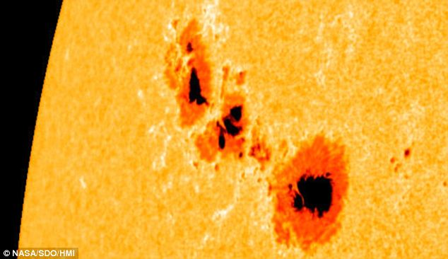

# Portafolio

## [Pronosticando el número de manchas solares](https://github.com/SAlexOA/Sunspots)
Este repositorio incluye el ajuste de un modelo ARMA para pronosticar el núméro de manchas solares. 

## [Clasificando estrellas con métodos supervisados](https://github.com/SAlexOA/Star_Classifier)
Este repositorio compara la efectividad de los métodos de clasificación "Decision Tree Classifier" y "Logistic Regression" para la clasificación de estrellas.

---

© 2020 Khanh Tran. Powered by Jekyll and the Minimal Theme.

